# GitHub 導入ガイド

> 3年生ゼミナール用資料 — GitHub アカウント作成から初めての push まで

---

## 目次

1. [GitHub とは](#1-github-とは)
2. [アカウントの作成](#2-アカウントの作成)
3. [Git のインストール](#3-git-のインストール)
4. [Git の初期設定](#4-git-の初期設定)
5. [リポジトリの作成](#5-リポジトリの作成)
6. [リポジトリのクローン(コピー)](#6-リポジトリのクローンコピー)
7. [変更 → コミット → プッシュ](#7-変更--コミット--プッシュ)
8. [GitHub 上で確認しよう](#8-github-上で確認しよう)
9. [GitHub Desktop(GUI での操作)](#9-github-desktopgui-での操作)
10. [よくある質問・トラブルシューティング](#10-よくある質問トラブルシューティング)
11. [用語集](#11-用語集)

---

## 1. GitHub とは

**GitHub(ギットハブ)**は、ソースコードを保存・管理・共有するための世界最大のウェブサービスです。
Git(ギット)というバージョン管理システムを使った「リポジトリ(コードの保管庫)」を、インターネット上の「Hub(中心地)」に置けることから、この名前が付けられました。

### GitHub の歴史

| 年 | できごと |
|---|---|
| 2005 | Linus Torvalds(Linux の作者)が **Git** を開発。わずか約10日で作られたと言われる |
| 2008 | Tom Preston-Werner、Chris Wanstrath、PJ Hyett らが **GitHub** を創業・公開 |
| 2008 | 同じ年に Bitbucket も誕生(こちらは当初 Mercurial 専用、2011年に Git 対応) |
| 2013 | ユーザー数 300万人突破 |
| 2018 | **Microsoft が約75億ドル(約8000億円)で買収** |
| 2023 | 開発者数 **1億人**突破を発表 |
| 現在 | 世界中のほぼすべての有名オープンソース(Linux、Python、React など)がここに置かれている |

### 小話:Octocat(オクトキャット)

GitHub のマスコットは、タコと猫が合体した「**Octocat**」です。
実はこれ、創業者が描いたキャラではなく、イラストレーターの Simon Oxley が素材サイト用に描いた「Octopuss(オクトパス)」というイラストを GitHub が買い取ったもの。ロゴの「中に猫がいる丸いマーク」も Octocat の一部です。
GitHub のエラーページ(404)を見ると、色々なコスチュームを着た Octocat が出てきます。試しに適当なURL(例: `github.com/aaaaaa`)を開いてみましょう。

ちなみに Octocat には公式アカウント([@octocat](https://github.com/octocat))もあって、テスト用リポジトリ [octocat/Hello-World](https://github.com/octocat/Hello-World) が置いてあります。

### 小話:「芝生(草)」

GitHub のプロフィールページには、毎日の活動量を緑の四角で表す「**コントリビューショングラフ**」があります。日本のエンジニアはこの緑のマスを「**芝生**」や「**草**」と呼び、「今日は草を生やした(=コミットした)」という表現が Twitter/X などでよく使われます。授業の課題を毎日コミットして、自分の芝生を育ててみましょう。

### 小話:北極のコード保管庫

2020年、GitHub は世界中の公開リポジトリのスナップショットをフィルムに焼き付け、**ノルウェーのスバールバル諸島(北極圏)の地下保管庫**に保存しました。「GitHub Arctic Code Vault」と呼ばれ、1000年後の人類にコードを残すプロジェクトです。あなたのコードも(公開なら)入っているかもしれません。

### Git と GitHub の違い(よく混ざるので注意)

- **Git**:バージョン管理システム本体。自分のPCにインストールして使う「道具」
- **GitHub**:Git のリポジトリを置いておけるウェブサービス。「置き場・SNS」

GitHub がなくても Git は使えます。逆に Git がないと GitHub にはコードを置けません。

---

## 2. アカウントの作成

1. [https://github.com](https://github.com) を開きます

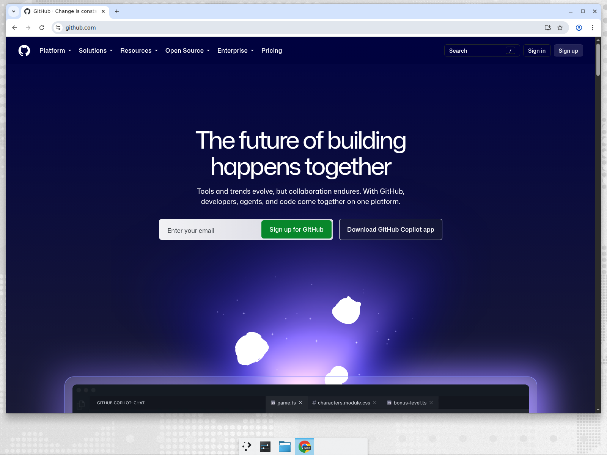

2. 右上の「**Sign up**」(またはトップのメール入力欄にアドレスを入れて「Sign up for GitHub」)をクリック
3. 以下を順番に入力します
   - **メールアドレス** → Continue
   - **パスワード**(15文字以上、または8文字以上+数字・小文字) → Continue
   - **ユーザー名**(半角英数字とハイフン。全世界で一意。後から変更も可能ですが、URL に使われるので慎重に) → Continue
   - プロダクト更新メールの可否(y/n) → Continue
4. 「Verify your account」のパズル(画像認証)を解く
5. メールに届いた **6桁のコード** を入力
6. いくつかのアンケート画面が出ますが、**skip personalization** でスキップしてOK

> **ポイント**:ユーザー名は `https://github.com/ユーザー名` という自分の公開URLになります。本名系・学籍番号系どちらでもOKですが、就活でプロフィールを見せることもあるので、恥ずかしくない名前にしておきましょう。

アカウントを持っている人は右上の「**Sign in**」からログインします。

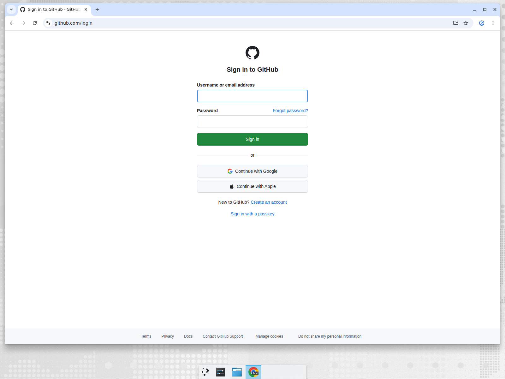

---

## 3. Git のインストール

GitHub を使う前に、自分の PC に **Git** をインストールします。

### Windows の場合

1. [https://git-scm.com/install/windows](https://git-scm.com/install/windows) を開きます

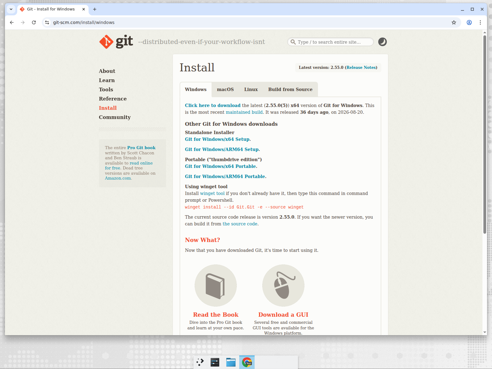

2. 「**Git for Windows/x64 Setup**」をダウンロードして実行
3. インストーラーの選択画面は**基本的に全部「Next」でOK**
   - エディタの選択だけ Vim が嫌な人は「Visual Studio Code」などに変えても良い
4. インストール後、「**Git Bash**」というアプリが入ります。Windows で Git を使うときはこれを開きます
   - または PowerShell / コマンドプロンプトでも `git` コマンドが使えます

### Mac の場合

ターミナルを開いて以下を実行します(開発者ツールのインストール確認が出たら「インストール」を選択)。

```bash
git --version
```

Homebrew を使っている人は `brew install git` でもOKです。

### インストール確認

ターミナル(Git Bash / PowerShell / Mac のターミナル)で:

```bash
git --version
# => git version 2.x.x などと表示されればOK
```

---

## 4. Git の初期設定

最初に「誰がコミットしたか」の名札を設定します。**これは最初の1回だけ**です。

```bash
git config --global user.name "Taro Yamada"
git config --global user.email "taro@example.com"
```

- `user.name` :自分の名前(GitHub のユーザー名と揃えると分かりやすい)
- `user.email` :GitHub に登録したメールアドレス

設定できたか確認:

```bash
git config --global user.name
git config --global user.email
```

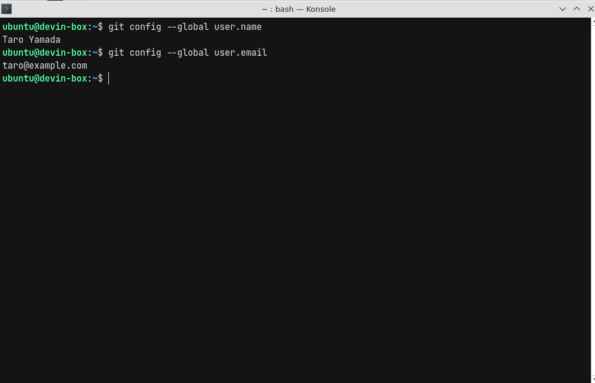

> **注意**:`--global` は「このPC全体の設定」という意味。これを忘れて毎回違う名前でコミットすると、履歴が汚れます。

---

## 5. リポジトリの作成

**リポジトリ(Repository)** = プロジェクトのフォルダ + 変更履歴の全部入り。
まず GitHub 上に「リモートの保管庫」を作ります。

1. GitHub にログインし、右上の「**+**」→「**New repository**」をクリック

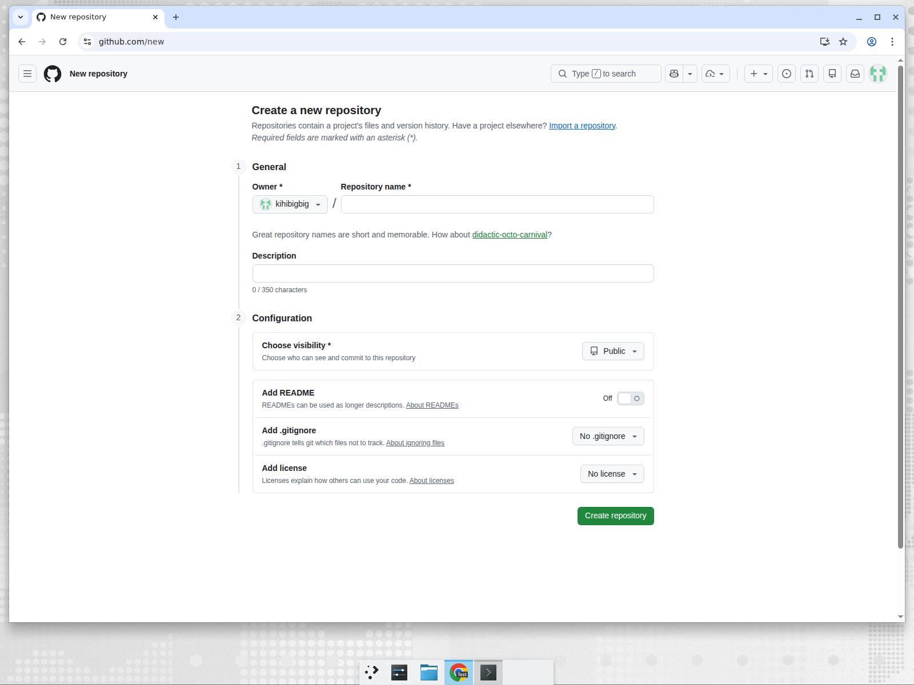

2. 以下を入力
   - **Repository name** :例 `hello-github`(ハイフン区切りの英小文字が定番)
   - **Description** :任意。例「ゼミの練習用」
   - **Public / Private** :練習なら Public でOK(課題など人に見せたくないものは **Private**)
   - ☑ **Add README** :これを On にしておくと、いきなりクローンできる状態で作られます
   - .gitignore / license :今は空でOK
3. 「**Create repository**」をクリック

作成すると、リポジトリのトップページ(下図のような画面)が表示されます。

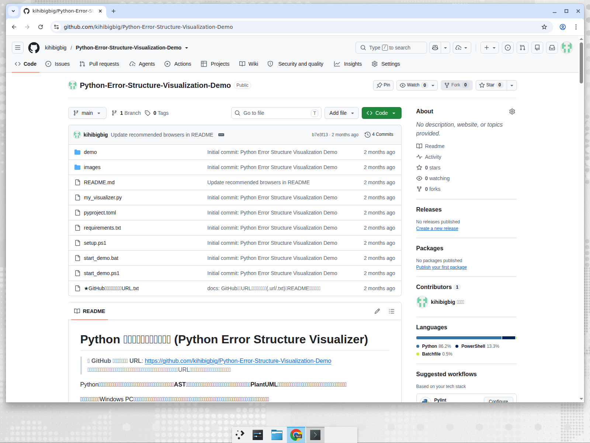

- **Code** タブ:ファイル一覧と README の表示
- **Issues**:課題・バグ管理の掲示板
- **Pull requests**:「この変更を取り込んでください」という提案機能。チーム開発の要
- **Star / Fork**:他人のリポジトリへの「いいね」と「自分へのコピー」

> **小話**:GitHub が広まった最大の理由は「**Fork + Pull Request**」という文化です。他人のコードをボタン1つで自分の所にコピー(Fork)し、直してから「これ取り込んでください」と提案(Pull Request)する。OSS への貢献が驚くほど簡単になりました。

---

## 6. リポジトリのクローン(コピー)

GitHub 上のリポジトリを、自分の PC に丸ごとコピー(履歴ごと)します。
これを「**クローン(clone)**」と言います。

1. リポジトリページの緑色の「**&lt;> Code**」ボタンをクリック
2. 「HTTPS」タブのURL(`https://github.com/ユーザー名/リポジトリ名.git`)をコピー
   - SSH や GitHub CLI を使う場合はタブを切り替え。ZIP でダウンロードだけしたい場合は「Download ZIP」

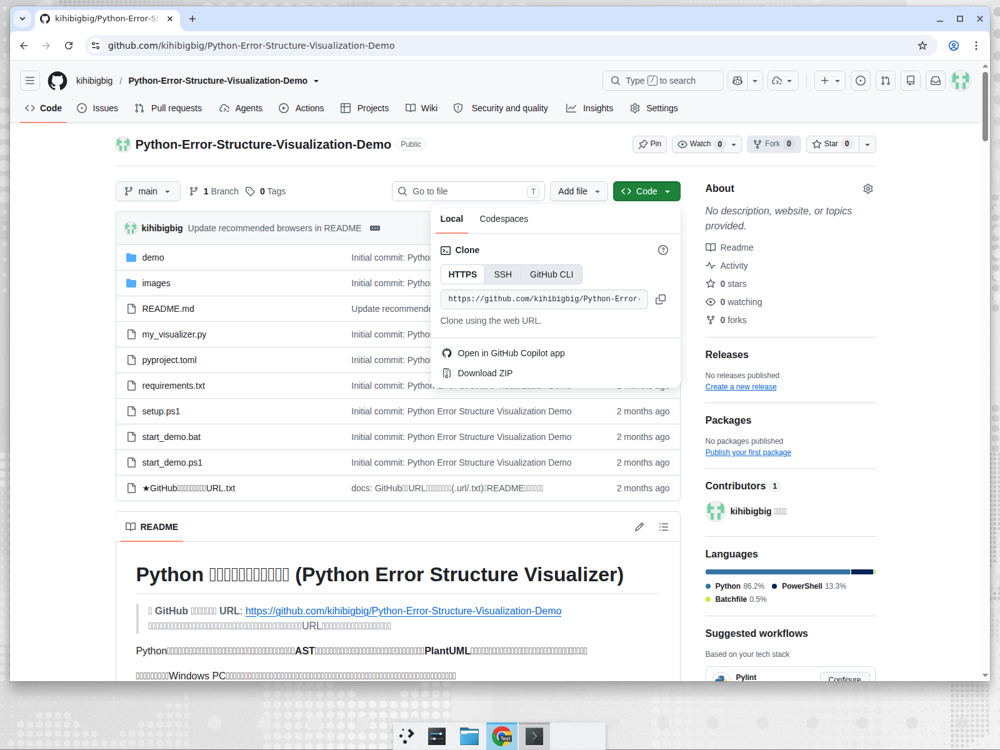

3. ターミナルで、作業用フォルダに移動してから実行

```bash
cd ~/work                     # 好きな作業フォルダへ
git clone https://github.com/ユーザー名/hello-github.git
cd hello-github               # クローンされたフォルダに入る
git log --oneline             # 履歴がコピーされているか確認
```

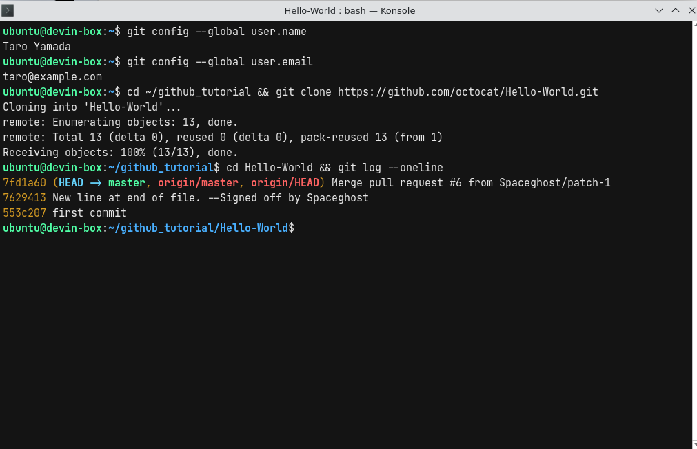

`git log` で最初のコミット(Initial commit)が見えれば成功です。

> **補足**:上の例の `master` は古いリポジトリのデフォルトブランチ名です。今新しく作るリポジトリでは `main` になります(詳しくは[Q&A](#10-よくある質問トラブルシューティング))。

---

## 7. 変更 → コミット → プッシュ

Git の基本ワークフローはこの3ステップです。

```
ファイルを変更 → git add(ステージング) → git commit(記録) → git push(GitHub に送信)
```

### 7-1. ファイルを変更する

`README.md` をエディタで開いて、適当に1行書き足して保存します。

```bash
echo "Hello GitHub!" >> README.md    # ターミナルからでもOK
```

### 7-2. 状態を確認・追加・コミット

```bash
git status                          # 変更されたファイルを確認(赤で表示)
git add README.md                   # コミット対象に登録(ステージング)
git commit -m "Add greeting"        # 変更を記録。メッセージは必須
git log --oneline                   # コミット履歴を確認
```

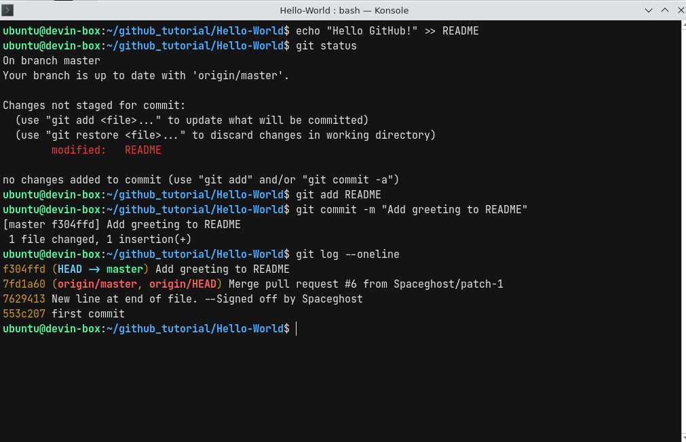

- `git add` :「この変更をコミットに含める」と指名する(カゴに入れるイメージ)
- `git commit -m "..."` :変更のスナップショットを保存。`-m` はコミットメッセージ
- コミットメッセージは「**何を・なぜ変えたか**」を書くのがマナー

### 7-3. GitHub へ送信(プッシュ)

```bash
git push origin main
```

- `origin` :クローン元の GitHub リポジトリのこと(自動で付く名前)
- `main` :メインのブランチ名(昔は `master` がデフォルトでした)

**初回 push 時の認証について(重要)**

GitHub は 2021年からパスワードでの push を廃止しました。初回は以下のどれかで認証します。

- **Git Credential Manager(おすすめ)**:Git for Windows に同梱。push すると自動でブラウザが開き「Authorize git-ecosystem」を押すだけ
- **GitHub Desktop**:アプリ経由なら認証は自動(セクション9参照)
- **Personal Access Token(PAT)**:パスワードの代わりに発行するトークン。Settings → Developer settings → Personal access tokens から作成

---

## 8. GitHub 上で確認しよう

push が終わったら、ブラウザでリポジトリページを**再読み込み**してみましょう。

- README に書き足した内容が反映されている
- 最新コミットメッセージとコミット数が増えている

コミット履歴は `https://github.com/ユーザー名/リポジトリ名/commits` で見られます。

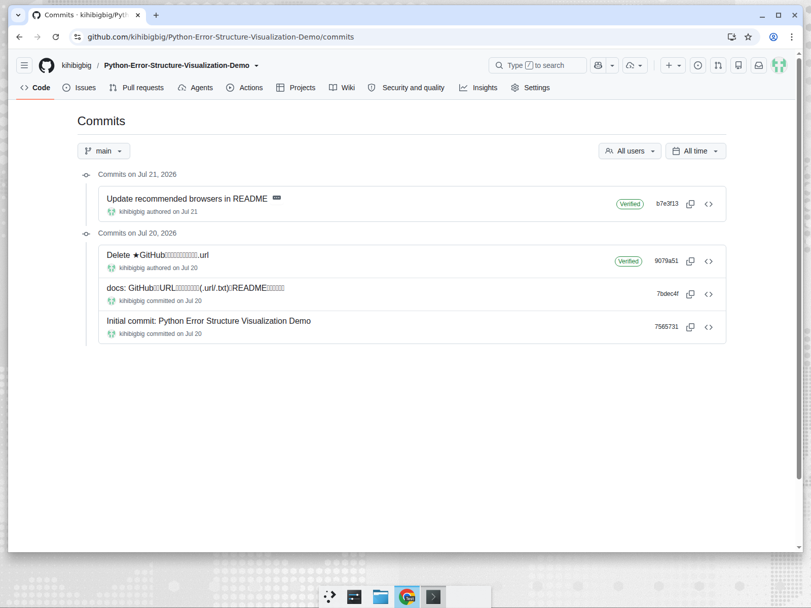

さらに、自分のプロフィールページ(`https://github.com/ユーザー名`)のコントリビューショングラフに**緑のマス(芝生)**が生えているはずです。

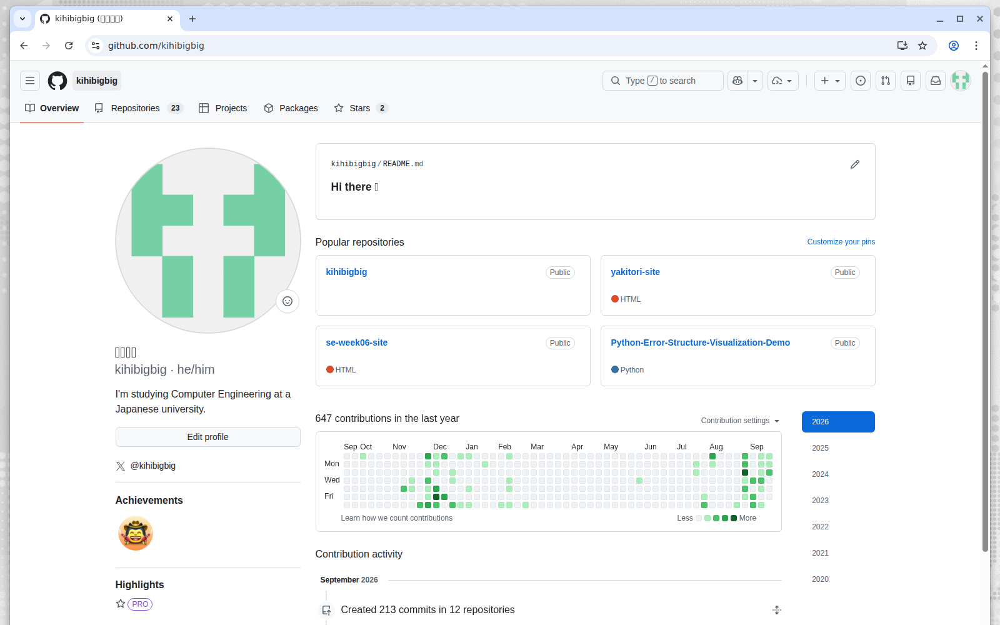

> **ここまでできた人は**:README をもう一回編集して add → commit → push を繰り返し、2つめの芝生を生やしてみましょう。

---

## 9. GitHub Desktop(GUI での操作)

コマンドが苦手な人には公式の GUI アプリ「**GitHub Desktop**」があります。
SourceTree が Bitbucket/Atlassian 製なのに対し、GitHub Desktop は GitHub 公式です。

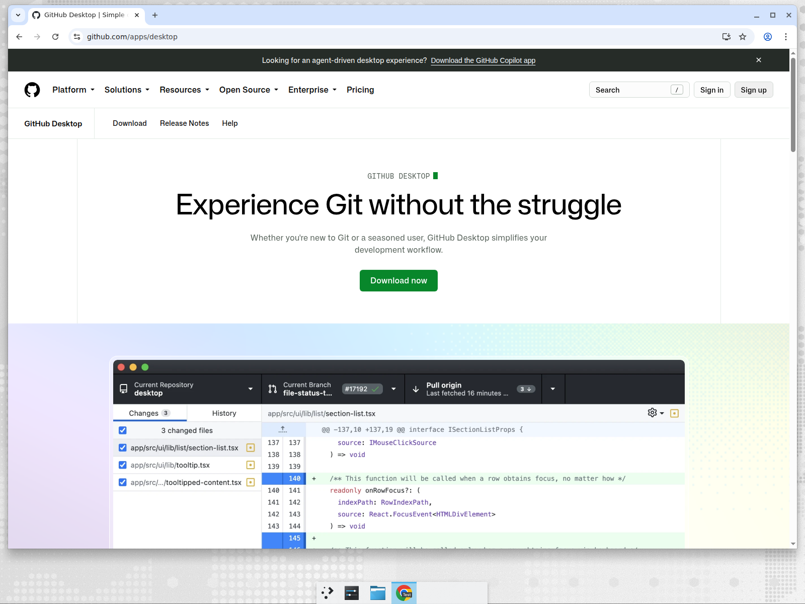

1. [https://github.com/apps/desktop](https://github.com/apps/desktop) からダウンロード&インストール
2. 起動して「**Sign in to GitHub.com**」でログイン(ブラウザ認証が走るのでトークン不要)
3. **File → Clone repository** で自分のリポジトリを選ぶだけでクローン完了
4. ファイルを編集すると左側の「**Changes**」に一覧表示される
   - 左下にコミットメッセージを入力 → 「**Commit to main**」
   - 上部の「**Push origin**」を押して GitHub に送信

コマンド操作の `add` / `commit` / `push` がそれぞれ「チェックボックス」「Commit ボタン」「Push origin ボタン」に対応しています。まずコマンドで流れを理解してから GUI に移るのがおすすめです。

> **補足**:去年使った **SourceTree** でも GitHub のリポジトリは操作できます(ツールはGit全般用なので)。ただし GitHub との親和性は GitHub Desktop の方が上です。

---

## 10. よくある質問・トラブルシューティング

**Q. push でパスワードを聞かれてエラーになる**
→ GitHub はパスワード push を廃止しています。Git Credential Manager のブラウザ認証を使うか、PAT を発行してください(セクション7-3)。

**Q. `fatal: not a git repository` と出る**
→ リポジトリのフォルダの中でコマンドを実行していません。`cd` でクローンしたフォルダに入ってください。

**Q. コミットする前に間違えたファイルを add してしまった**
→ `git restore --staged ファイル名` でステージングから外せます。

**Q. リポジトリを消したい**
→ リポジトリの **Settings → 一番下の Danger Zone → Delete this repository**。削除は取り消せないので注意。

**Q. Public と Private どっち?**
→ 練習用・ポートフォリオ用は Public、個人情報・未公開の成果物は Private。秘密鍵やパスワードは**絶対に**どちらにも push しないこと。

**Q. `master` と `main` って何が違う?**
→ 昔のデフォルトブランチ名は `master` でしたが、現在 GitHub の標準は `main` です。古い資料では `master` が残っていることがあります。

---

## 11. 用語集

| 用語 | 意味 |
|---|---|
| リポジトリ | プロジェクトの保管庫(ファイル + 変更履歴) |
| クローン (clone) | リモートのリポジトリを自分のPCに丸ごとコピー |
| コミット (commit) | 変更を履歴として記録するスナップショット |
| プッシュ (push) | ローカルのコミットを GitHub に送信 |
| プル (pull) | GitHub 側の最新をローカルに取り込む(明日の自分や他人の変更) |
| ブランチ (branch) | 履歴の分岐。`main` が本線 |
| フォーク (fork) | 他人のリポジトリを自分のアカウントにコピー |
| プルリクエスト (PR) | フォーク/ブランチの変更を本家に取り込んでほしいと提案する機能 |
| スター (star) | お気に入り登録。OSS への応援印 |
| README.md | リポジトリの顔になる説明書。Markdown 記法で書く |
| Markdown | この資料も書かれている軽量マークアップ言語。GitHub は `.md` を自動整形表示 |

---

## 参考リンク

- GitHub 公式ドキュメント(日本語):<https://docs.github.com/ja>
- GitHub Skills(公式の手を動かす入門):<https://skills.github.com>
- **GitHub Student Developer Pack**(学生特典:Copilot Pro など無料):<https://education.github.com/pack>
- Pro Git 日本語版(無料の Git 教科書):<https://git-scm.com/book/ja/v2>
